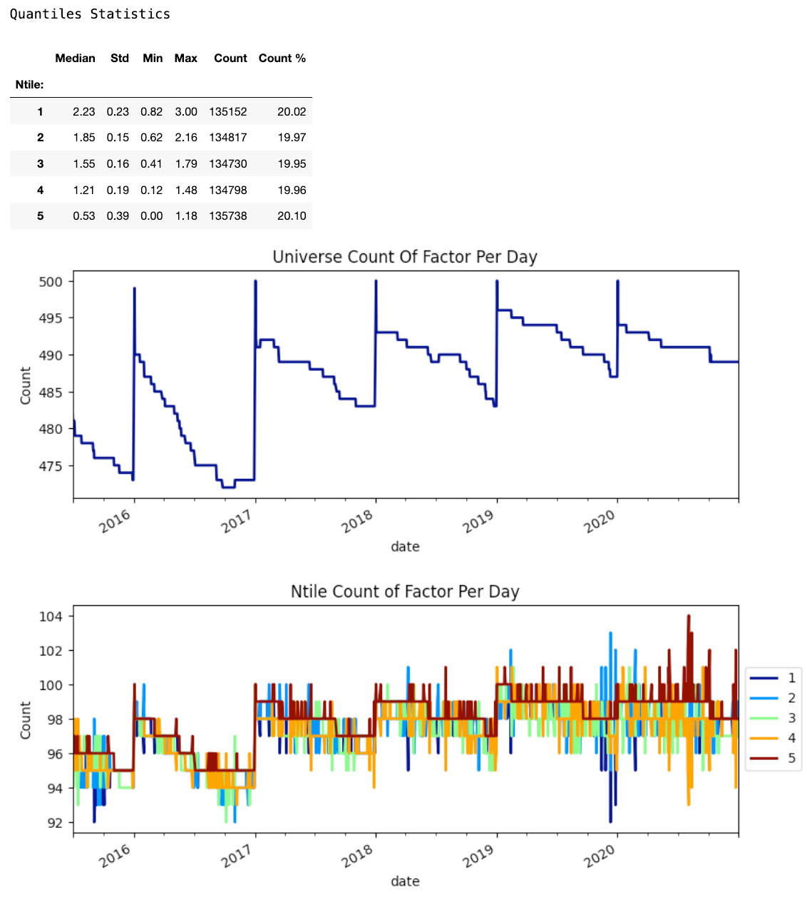
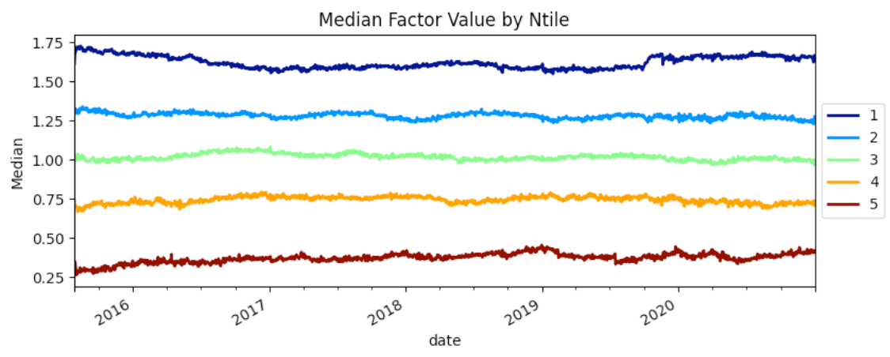
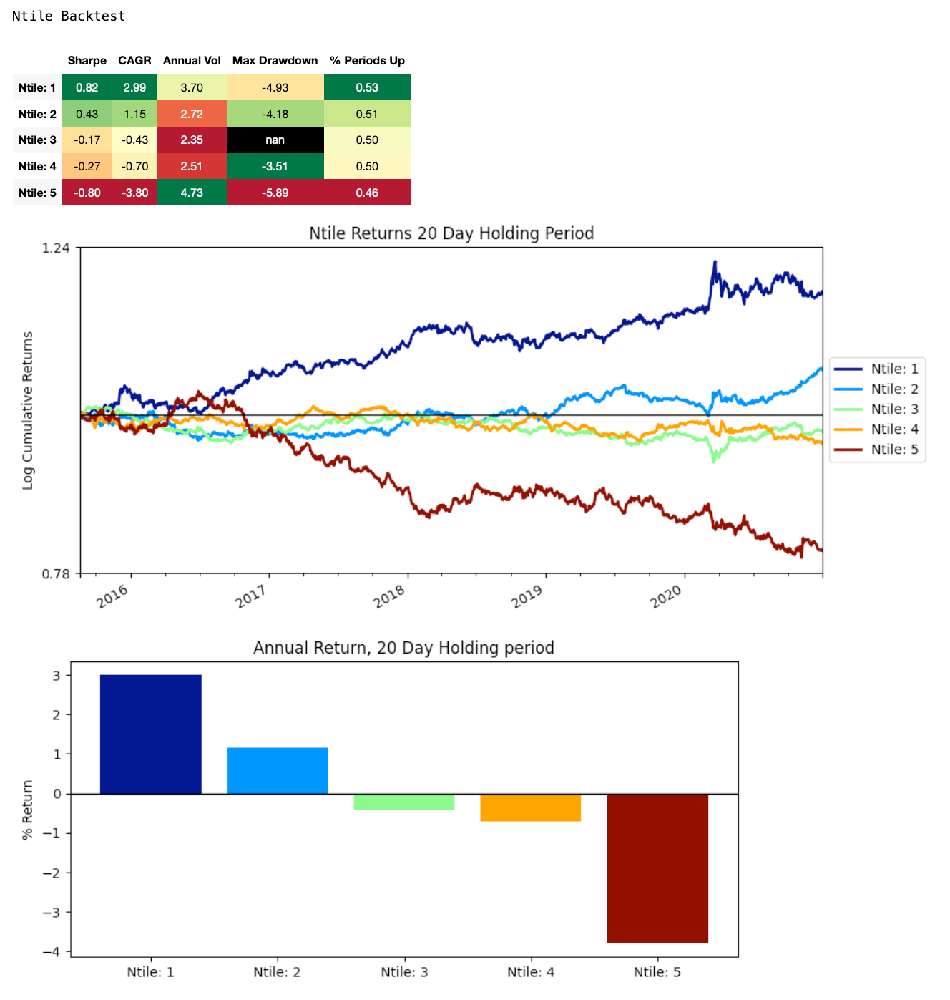
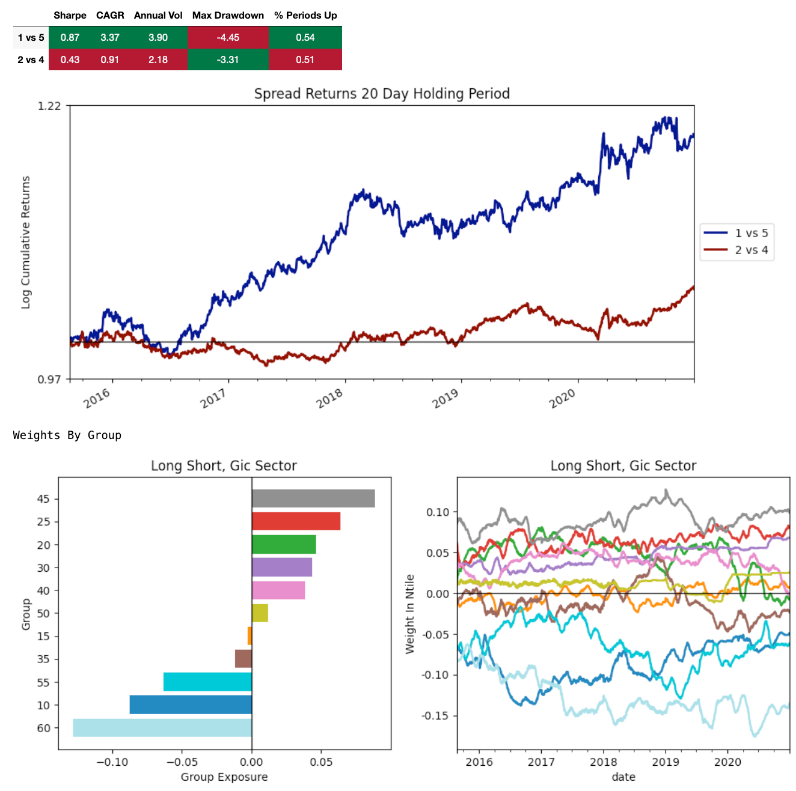
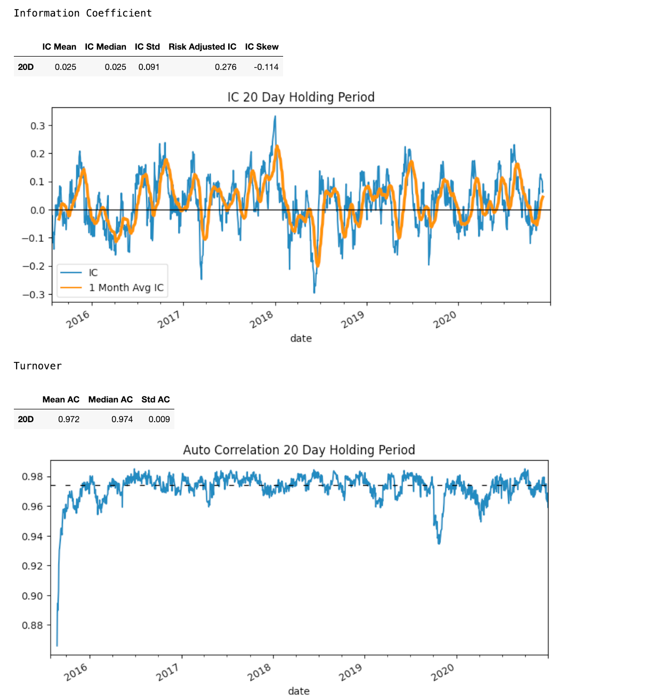

```python
pip install ntiles
```

### API
```python
from ntiles import Ntile, PricingPortal, SectorPortal

# getting the asset pricing data
pricing_portal = PricingPortal(assets=my_universe, start='2017-01-01', end='2021-01-01')
# getting the group data, this is optional
group_portal = SectorPortal(assets=my_universe)

# generating tearsheets
tile = Ntile(pricing_portal=pricing_portal, group_portal=group_portal)
tile.full_tear(factor=my_factor, ntiles=5, holding_period=20)
```

### Example Tearsheet




